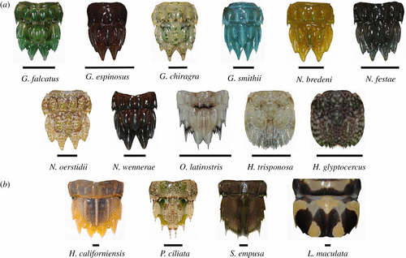

## Required Packages

- dplyr was used to manipulate the data
- ggplo2 was used to create figures 
- tidyr was not used since the data was already arranged to desired standards

```{r, message=FALSE, warning=FALSE}
library(dplyr)
library(ggplot2)
```

## Data used

```{r}
data_1 <- read.csv("https://ndownloader.figshare.com/files/16851587")
knitr::kable(data_1)

```

## What does this data describe? (Prose)



- Many types of animals develop morphological traits to partake in ritualized combat.
- Mantis shrimp present an interesting case in which their unique form of ritualized combat, termed telson sparring, may have coevolved with specialized morphological armour.

## Data Manipulation

- I mutated data_1 to add a new column of the ratio between the telson COR and abdomen COR
- lower ratio = telson and abdomen COR difference smaller
- higher ratio = telson and abdomen COR differece larger (telson COR is greater)
- I then separated the data into a "small" and "big" category by filtering the mass of the shrimp. This was done to create figures with clearer axis. 

```{r, message=FALSE, warning=FALSE, echo=TRUE}
data_1_modified <- mutate(data_1, ratio = (cor.telson/cor.abdomen))
big_shrimps <- data_1_modified %>%
  group_by(species) %>%
  filter(mass > 15)
small_shrimps <- data_1_modified %>%
  group_by(species) %>%
  filter(mass < 15)
```

## Figures
The figures created use mass on the x axis and the ratio of COR between the telson and the abdomen.

Geom_point and geom_smooth are used to create points and a trend line, the axis are then scaled to the minimum and maximum mass and ratio values for the small and big categories.

Then, facet_wrap is used to seaparate the graphs by species. 

The purpose of this manipulation was to determine if there was a relationship between mass and ratio of COR telson vs abdomen across different species of mantis shrimp. 

## Figure 1 
```{r, message=FALSE, warning=FALSE, echo=FALSE}
ggplot(small_shrimps,aes(x=mass,y=ratio))+
  geom_point(shape=1)+
  geom_smooth(method=lm)+
  scale_x_continuous(limit=c(min(small_shrimps$mass),max(small_shrimps$mass)))+
  scale_y_continuous(limit=c(min(small_shrimps$ratio),max(small_shrimps$ratio)))+
  labs(x="mass(g)",y="COR Telson to Abdomen Ratio")+
  facet_wrap(~species, scales = "free_x")

ggsave("../figures/small_shrimps_figure.jpg")
```

## Figure 2
```{r, message=FALSE, warning=FALSE, echo=FALSE}
ggplot(big_shrimps,aes(x=mass,y=ratio))+
  geom_point(shape=1)+
  geom_smooth(method=lm)+
  scale_x_continuous(limit=c(min(big_shrimps$mass),max(big_shrimps$mass)))+
  scale_y_continuous(limit=c(min(big_shrimps$ratio),max(big_shrimps$ratio)))+
  labs(x="mass(g)",y="COR Telson to Abdomen Ratio")+
  facet_wrap(~species, scales = "free_x")

ggsave("../figures/big_shrimps_figure.jpg")
```

