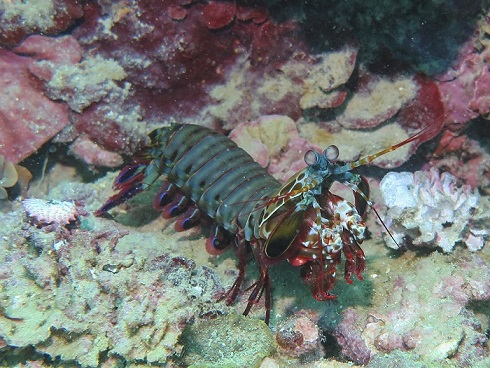
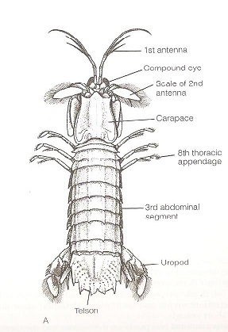
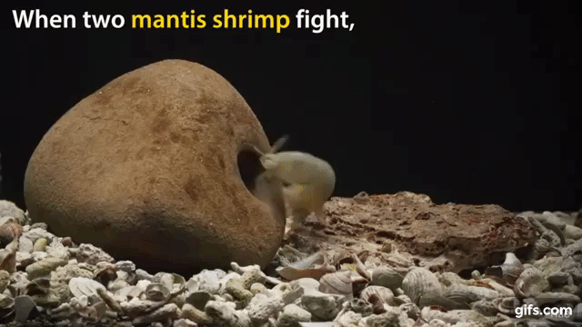

## Required Packages

- dplyr was used to manipulate the data
- ggplo2 was used to create figures 
- tidyr was not used since the data was already arranged to desired standards

```{r, message=FALSE, warning=FALSE}
library(dplyr)
library(ggplot2)
```

## What is a Mantis Shrimp?



- Mantis shrimps or stomatopods
- Marine crustaceans of the order Stomatopoda 
- Some species have blunt forelimbs while others have sharp ones

## External Anatomy



- Appendages
- Telson

## Telson Sparring



- During telson sparring, mantis shrimp take turns striking with their appendages against the telson of their opponent
- Individuals direct nearly every strike to the telson, and this is facilitated by the recipient assuming a coiled position referred to as a ‘telson coil’

## Data used

```{r}
data_1 <- read.csv("https://ndownloader.figshare.com/files/16851587")
knitr::kable(data_1)

```

## What does this data describe? (Prose)


- Many types of animals develop morphological traits to partake in ritualized combat.
- Mantis shrimp present an interesting case in which their unique form of ritualized combat, termed telson sparring, may have coevolved with specialized morphological armour.

## What is COR?

- The coefficient of restitution (COR), also denoted by (e), is the ratio of the final to initial relative velocity between two objects after they collide

- can also be viewed in terms of kinetic energy before and after a collision. 

- e is usually a positive number between 0 and 1:

- e = 0: This is a perfectly inelastic collision. Kinetic energy is dissipated (converted to heat or work). 

- 0 < e < 1: This is a real-world inelastic collision, in which some kinetic energy is dissipated.

- e = 1: This is a perfectly elastic collision, in which no kinetic energy is dissipated, and the objects rebound from one another with the same initial velocity.


## Data Manipulation

```{r, message=FALSE, warning=FALSE, echo=TRUE}

smasher_data <- data_1 %>%
  group_by(appendage) %>%
  filter(appendage == "smasher") #strings need quotes 

spearer_data <- data_1 %>%
  group_by(appendage) %>%
  filter(appendage != "smasher")

```

## Figures


## Figure 1 
```{r, message=FALSE, warning=FALSE, echo=FALSE}

```

## Figure 2
```{r, message=FALSE, warning=FALSE, echo=FALSE}


```


